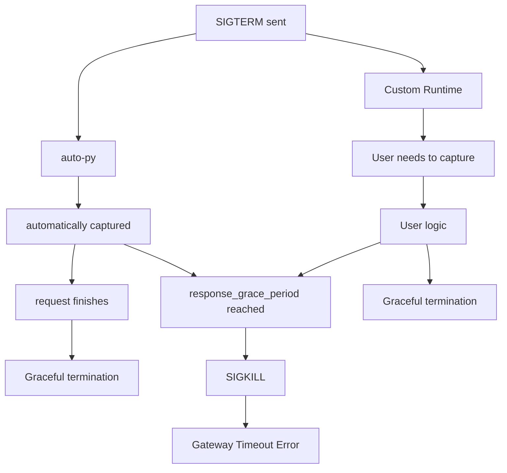

## Graceful Termination

Cerebrium runs in a shared, multi-tenant environment. To efficiently scale, optimize compute usage, and roll out updates, the platform continuously adjusts its capacity - spinning down nodes and launching new ones as needed. During this process, workloads are seamlessly migrated to new nodes. In addition, your application has its own metric-based autoscaling criteria that dictate when instances should scale or remain active, as well as handle instance shifting during new app deployments. Therefore, in order to prevent requests from ending prematurely when we mark app instances for termination, you need to implement graceful termination.

## Understanding Instance Termination

For both application autoscaling and our own internal node scaling, we will send your application a SIGTERM signal, as a warning to the application that we are intending to shut down this instance. For auto-py applications (Cerebriums default runtime), this is handled. On custom runtimes, should you wish to gracefully shut down, you will need to catch and handle this signal. Once at least `response_grace_period` has elapsed, we will send your application a SIGKILL signal, terminating the instance immediately.

When Cerebrium needs to terminate an contanier, we do the following:

1. Stop routing new requests to the container.
2. Send a SIGTERM signal to your container.
3. Waits for `response_grace_period` seconds to elaspse.
4. Sends SIGKILL if the container hasn't stopped

Below is a chart that shows it more eloquently:



If you do not handle SIGTERM in the custom runtime, Cerebrium terminates containers immediately after sending `SIGTERM`, which can interrupt in-flight requests and cause **502 errors**.

## Implementation

For custom runtimes using FastAPI, implement the [`lifespan` pattern](https://fastapi.tiangolo.com/advanced/events/) to respond to SIGTERM.

### main.py

Create a new file named `main.py` with the following:

```python
from fastapi import FastAPI, HTTPException, Request
from contextlib import asynccontextmanager
import asyncio
from dataclasses import dataclass

@dataclass
class AppState:
    active_requests: int = 0
    shutting_down: bool = False
    shutdown_event: asyncio.Event = None
    lock: asyncio.Lock = None

    def __post_init__(self):
        if self.shutdown_event is None:
            self.shutdown_event = asyncio.Event()
        if self.lock is None:
            self.lock = asyncio.Lock()

@asynccontextmanager
async def lifespan(app: FastAPI):
    app.state.app_state = AppState()
    yield

    state = app.state.app_state
    state.shutting_down = True

    if state.active_requests > 0:
        try:
            await asyncio.wait_for(state.shutdown_event.wait(), timeout=30.0)
        except asyncio.TimeoutError:
            pass

app = FastAPI(lifespan=lifespan)

@app.middleware("http")
async def track_requests(request: Request, call_next):
    state: AppState = request.app.state.app_state

    async with state.lock:
        if state.shutting_down:
            raise HTTPException(status_code=503, detail="Service shutting down")
        state.active_requests += 1

    try:
        response = await call_next(request)
        return response
    finally:
        async with state.lock:
            state.active_requests -= 1
            if state.shutting_down and state.active_requests == 0:
                state.shutdown_event.set()

@app.get("/ready")
async def ready(request: Request):
    state: AppState = request.app.state.app_state

    async with state.lock:
        if state.shutting_down:
            raise HTTPException(status_code=503, detail="Not ready - shutting down")

    return {"status": "ready", "active_requests": state.active_requests}

@app.post("/hello")
def hello():
    return {"message": "Hello Cerebrium!"}
```

### cerebrium.toml

If you already have a `cerebrium.toml` file, add or update these sections. If you don't have one, create a new file with the following:

```toml
[deployment]
name = "your-app-name"
include = ["./*"]
exclude = [".*"]

[hardware]
cpu = 1
memory = 1.0
compute = "CPU"
gpu_count = 0
provider = "aws"
region = "us-east-1"

[scaling]
min_replicas = 0
max_replicas = 2
cooldown = 30
replica_concurrency = 1  # Must match max_concurrency in your AppState

[runtime.docker]
port = 8000
dockerfile_path = "./Dockerfile"
```

**Key configuration notes:**

- `replica_concurrency` should match `max_concurrency` in your `AppState` class (if you add that field)
- `port` must match the port in your Dockerfile CMD
- Adjust hardware settings based on your application needs

### Dockerfile

Create a new file named `Dockerfile` with the following:

```dockerfile
FROM python:3.12-bookworm
COPY . .
RUN pip install -r requirements.txt
EXPOSE 8000
CMD ["uvicorn", "main:app", "--host", "0.0.0.0", "--port", "8000"]
```

### requirements.txt

Add to your existing `requirements.txt` or create a new file with:

```
fastapi[standard]
```

## Key Points

- The `/ready` endpoint is essential for proper load balancing during scaling events
- Without a proper `/ready` endpoint, Cerebrium uses TCP ping which only checks if the port is open, potentially routing traffic to replicas that are shutting down
- The 30-second shutdown timeout in the lifespan function is configurable
- All request tracking uses asyncio locks to ensure thread safety

<Tip>
  Test SIGTERM handling locally before deploying: start your app, send SIGTERM
  with `Ctrl+C`, and verify you see graceful shutdown logs.
</Tip>
